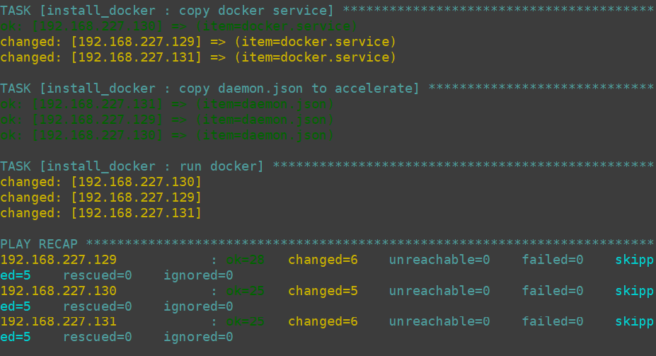
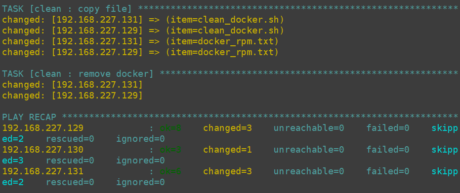

# 条件:最小化centos7系统版本


# 1.本地环境安装ansible

#####  执行安装ansib离线rpm包(含依赖)

```shell
sh init.sh
```

#####  还原执行

```shell
sh reset_init.sh
```


# 2.安装环境初始化

#####  修改inventory服务器信息（这里服务器ip，端口号，密码需改为自己的）

#####  实现免密登陆

```shellsh
sh ssh.sh inventory
```

#####  执行初始化安装服务器的环境

（会先免密登陆，然后创建目录，复制配置文件和脚本，执行脚本设置系统参数，判断关闭防火墙和selinux，添加epel-7.repo加速源）

```shell
sh install_init.sh inventory
```


# 3.管理docker

#####  采用压缩率较高的tar.xz格式压缩docker和其依赖包，提高传输效率，节省带宽，加上判断docker是否存在才执行决定是否执行安装，清理操作，传输docker.service文件使用systemctl来管理docker，通过修改daemon.json来加速docker镜像

------


### 安装docker（三台机器同时安装，任务耗时2分钟）

```shell
sh install_docker.sh inventory

```



------


### 清理docker

```shell
sh clean.sh inventory
```




##### 参考文档

https://hub.docker.com/layers/redis/library/redis/6.0.6-alpine3.12/images/sha256-bfc2818d0367c9771b79fa5850933c0129d6da2dba9c56e6ebffe697bc16ec0b?context=explore

https://docs.docker.com/engine/reference/builder/

https://docs.ansible.com/ansible/latest/index.html

https://redis.io/documentation

