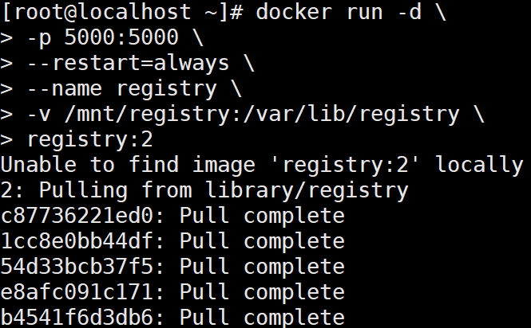

## docker仓库

Docker仓库（Repository）类似与代码仓库，是Docker集中存放镜像文件的地方。 

> 基本操作

登陆

```
sudo docker login --username=jayiq registry.cn-hangzhou.aliyuncs.com
```

拉取镜像

```
sudo docker pull registry.cn-hangzhou.aliyuncs.com/hjj_docker/docker_repo:[镜像版本号]
```

推送镜像

```
$ sudo docker login --username=jayiq registry.cn-hangzhou.aliyuncs.com
$ sudo docker tag [ImageId] registry.cn-hangzhou.aliyuncs.com/hjj_docker/docker_repo:[镜像版本号]
$ sudo docker push registry.cn-hangzhou.aliyuncs.com/hjj_docker/docker_repo:[镜像版本号]
```


> 不同仓库

##### docker hub 

1.打开https://hub.docker.com/ 

2、注册账号

3、创建仓库（Create Repository）

4、设置镜像标签 docker tag local‐image:tagname new‐repo:tagname（设置tag） eg:docker tag hello‐world:latest 108001509033/test‐hello‐world:v1 

5、登录docker hub docker login(回车，输入账号以及密码)

6、推送镜像 docker push new‐repo:tagname eg：docker push 108001509033/test‐hello‐world:v1


##### 阿里云 (参考官方文档)

步骤：

1、创建阿里云账号 

2、创建命名空间 

3、创建镜像仓库 

<https://cr.console.aliyun.com/repository/cn-hangzhou/hjj_docker/>

4、操作指南 

<https://cr.console.aliyun.com/repository/cn-hangzhou/hjj_docker/docker_repo/details>

登陆账号

$ sudo docker login ‐‐username=[账号名称] registry.cnhangzhou.aliyuncs.com

打标签并把镜像推送到Registry

$ sudo docker tag [ImageId] registry.cnhangzhou.aliyuncs.com/360buy/portal:[镜像版本号] 

$ sudo docker push registry.cn‐hangzhou.aliyuncs.com/360buy/portal:[镜像版 本号]


过程：

 ~]# docker images
REPOSITORY          TAG                 IMAGE ID            CREATED             SIZE
tomcat              latest              47b006f2aee9        2 weeks ago         815MB
mytomcat            latest              6013f158b403        2 weeks ago         815MB
centos              latest              0f3e07c0138f        2 months ago        220MB
hello-world         latest              fce289e99eb9        11 months ago       1.84kB
jenkins             latest              cd14cecfdb3a        17 months ago       696MB
 ~]# sudo docker tag fce289e99eb9 registry.cn-hangzhou.aliyuncs.com/hjj_docker/docker_repo:v1
~]# docker images
REPOSITORY                                                 TAG                 IMAGE ID            CREATED SIZE
tomcat                                                     latest              47b006f2aee9        2 weeks ago 815MB
mytomcat                                                   latest              6013f158b403        2 weeks ago 815MB
centos                                                     latest              0f3e07c0138f        2 months ago 220MB
hello-world                                                latest              fce289e99eb9        11 months ago 1.84kB
registry.cn-hangzhou.aliyuncs.com/hjj_docker/docker_repo   v1                  fce289e99eb9        11 months ago 1.84kB
jenkins                                                    latest              cd14cecfdb3a        17 months ago 696MB
~]# sudo docker push registry.cn-hangzhou.aliyuncs.com/hjj_docker/docker_repo:v1
The push refers to repository [registry.cn-hangzhou.aliyuncs.com/hjj_docker/docker_repo]
af0b15c8625b: Pushed
v1: digest: sha256:92c7f9c92844bbbb5d0a101b22f7c2a7949e40f8ea90c8b3bc396879d95e899a size: 524


>  构建私有仓库  

 1、启动Docker Registry(使用Docker官方提供的Registry镜像就可搭建本地私有镜像仓库)



指令参数说明： ‐d：表示在后台运行该容器； ‐p 5000:5000：表示将私有镜像仓库容器内部默认暴露的5000端口映射到宿主机的5000端 口 ‐‐restart=always：表示容器启动后自动启动本地私有镜像仓库 ‐‐name registry：表示为生成的容器命名为registry ‐v /mnt/registry:/var/lib/registry：表示将容器内的默认存储位 置/var/lib/registry中的数据挂载到宿主机的/mnt/registry目录下，这样当容器销毁 后，在容器中/var/lib/registry目录下的数据会自动备份到宿主机指定目录/mnt/registry

最后的registry:2解说

Docker Registry目前有v1和v2两个版本，v2版本并不是v1版本的简单升级，而是在很多 功能上都有了改进和优化。v1版本使用的是Python开发的，而v2版本是用go语言开发的； v1版本本地镜像仓库容器中数据默认挂载点是/tmp/registry，而v2版本的本地镜像仓库容 器中数据默认挂载点是/var/lib/registry

2、修改镜像名称（镜像名必须符合“仓库IP:端口 号/repository”的形式）

指定镜像推送 到本地私有镜像仓库。由于推送到本地私有镜像仓库的镜像名必须符合“仓库IP:端口 号/repository”的形式，因此需要按照要求修改镜像名称，具体操作指令如下。 

```
docker tag hello‐world:latest localhost:5000/myhellodocker
```

3、推送镜像

本地私有镜像仓库搭建并启动完成，同时要推送的镜像也已经准备就绪后，就 可以将指定镜像推送到本地私有镜像仓库了，具体操作指令如下（这里localhost:5000/myhellodocker就是hello-world:latest的镜像）

```
 $ docker push localhost:5000/myhellodocker
```

4、查看本地仓库镜像 

宿主机IP:5000/v2/myhellodocker/tags/list  （注意：使用该地址时注意镜 像名称）
由于做了目录挂载，因此可以在本地的该目录下查看：
/mnt/registry/docker/registry/v2/repositories