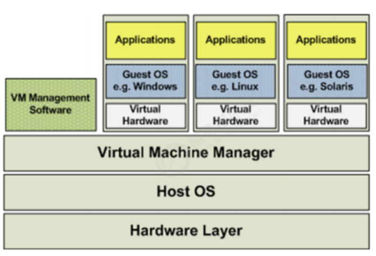
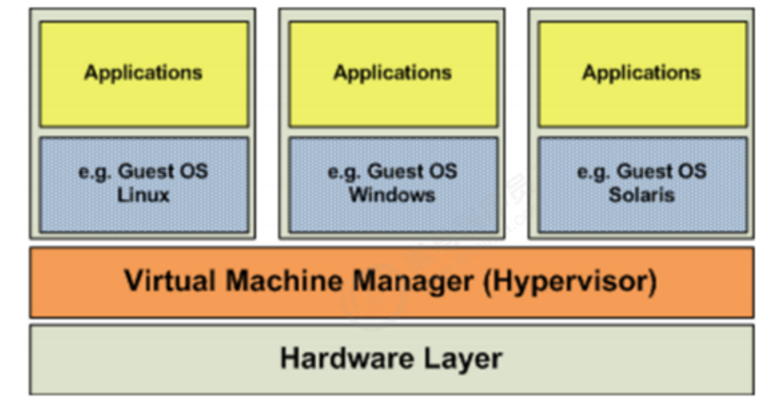
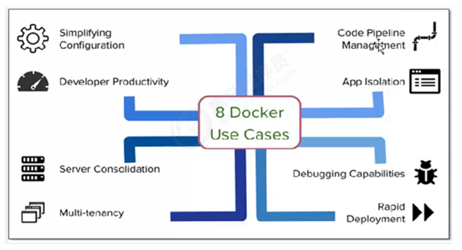
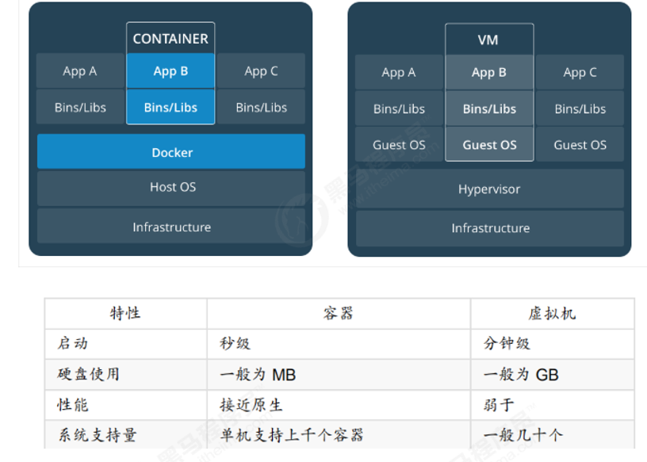

# 主要指令

  不会查文档：docker run --help     docker image --help 以此类推

​                         docker --help

```
查看docker详细信息    
                    docker info
查看docker版本       
                    docker ‐‐version/version(c/s  server：docker engine架构)
启动/停止/重启docker：
                    sudo systemctl start/stop/restart docker
Ubuntu：开机自动启动 
CentOS：手动启动      
                    systemctl enable docker（开机启动）
查看docker运行状态    
                    sudo sytemctl status docker
**********************************************************
列出镜像（镜像都是存储在Docker宿主机的/var/lib/docker目录）      
                    docker images

查找镜像（stars：用户评价  auto commit：表该镜像由Docker Hub自动构建流程创建的 ）  
                    docker search 镜像名称

拉取镜像             docker pull 镜像名称[:version]
删除镜像              
                    删除一个   docker rmi 镜像名称/id
                    删除多个   docker rmi 镜像名称/id1 镜像名称/id2
                    删除全部   docker rmi `docker images -q`
                    
创建容器（‐i：交互式容器   ‐t：tty 终端    ‐d:后台运行，并且打印容器id）           
                    docker run ‐‐name=u1 ubuntu 
                    docker run ‐i ‐t ‐‐name=u1 ubuntu /bin/bash 
                    docker run ‐i ‐t ‐d ‐‐name=u3 ubuntu /bin/bash
进入容器             
                    docker attach 容器名称/id    (ps:exit,容器停止) 
                    docker exec ‐it 容器名称/id /bin/bash（ps:exit,容器不会停止） 
查看容器 
                    docker ps：查看正在运行的容器 
                    docker ps ‐a：查看运行过的容器（历史） 
                    docker ps ‐l：最后一次运行的容器          
停止/启动容器         
                    docker start 容器名称/id 
                    docker stop 容器名称/id

获取容器/镜像的元数据
                    docker inspect 容器/镜像
                    docker inspect ‐f='{{.NetworkSettings.IPAddress}}' 
                    （容器/镜像 ‐f：可通过‐‐format代替）
删除容器
                    删除一个容器   docker rm 容器名称/id
                    删除多个容器   docker rm 容器名称1/id1 容器名称2/id2 ...
                    删除所有容器   docker rm `docker ps ‐a ‐q`
                    （PS：无法删除正在运行的容器）
查看容器日志
                    docker logs 容器名称/id
文件拷贝             
                    docker cp  1.txt c2:/root
                    docker cp c2:/root/2.txt /root 

目录挂载（将宿主机的目录与容器内的进行映射，这样我们就可通过修改宿主机某个目录的文件从而去影响容器）   
                    docker run ‐id ‐‐name=c4 ‐v /opt/:/usr/local/myhtml centos
                    docker run ‐id ‐‐privileged=true ‐‐name=c4 ‐v /opt/:/usr/local/myhtml  centos（共享的是多级的目录，可能会出现权限不足的提示是因为CentOS7中的安全模块selinux把权限禁掉了，我们需要添加参数  -privileged=true  来解决挂载的目录没有权限
）
```

# 安装和配置

```
1.安装与验证是否可用（https://docs.docker.com/install/linux/docker-ce/centos/）
sh docker_install.sh

2.配置镜像加速器：
（参考该网站具体的文档操作）
‐ 阿里云（先加入阿里云开发者平台：https://dev.aliyun.com）
      登录》弹性计算的容器镜像服务》管理控制台》镜像加速器
      
sudo mkdir -p /etc/docker
sudo tee /etc/docker/daemon.json <<-'EOF'
{
  "registry-mirrors": ["https://5wjm672p.mirror.aliyuncs.com"]
}
EOF
sudo systemctl daemon-reload
sudo systemctl restart docker
验证：cat /etc/docker/daemon.json发现里面有阿里云的镜像地址

其他镜像加速器
‐ docker中国加速器（https://www.docker‐cn.com) 
‐ USTC加速器（https://lug.ustc.edu.cn/wiki/ ）  真正的公共服务（无需任何操作） 
‐ daocloud、网易蜂巢加速器等

```


# docker架构


4.1 docker daemon 
The Docker daemon ( dockerd ) listens for Docker API requests and manages Docker objects such as images, containers, networks, and volumes. A daemon can also communicate with other daemons to manage Docker services. (Docker守护程 序（dockerd）侦听Docker API请求并管理Docker对象，如图像，容器，网络和卷。 守 护程序还可以与其他守护程序通信以管理Docker服务。)

 4.2 docker client 
The Docker client ( docker ) is the primary way that many Docker users interact with Docker. When you use commands such as  docker run , the client sends these commands to  dockerd , which carries them out. The  docker  command uses the Docker API. The Docker client can communicate with more than one daemon. (Docker客户端（docker）是许多Docker用户与Docker交互的主要方式。 当您使用诸如 docker run之类的命令时，客户端会将这些命令发送到dockerd，后者将其执行。 docker命令使用Docker API。 Docker客户端可以与多个守护进程通信。) 4.3 docker registry 

A Docker registry stores Docker images. Docker Hub is a public registry that anyone can use, and Docker is configured to look for images on Docker Hub by default. You can even run your own private registry. If you use Docker Datacenter (DDC), it includes Docker Trusted Registry (DTR).
When you use the docker pull or docker run commands, the required images are pulled from your configured registry. When you use the docker push command, your image is pushed to your configured registry.(Docker注册表存储 Docker镜像。 Docker Hub是任何人都可以使用的公共注册中心，Docker配置为默认在 Docker Hub上查找图像。 您甚至可以运行自己的私人注册表。 如果您使用Docker Datacenter（DDC），它包括Docker Trusted Registry（DTR）。使用docker pull或 docker run命令时，将从配置的注册表中提取所需的映像。 使用docker push命令时， 图像将被推送到配置的注册表。) 

5 docker镜像操作 
Docker 镜像是容器的基础。镜像是一个有序集合，其中包含根文件系统更改和在容器运 行时中使用的相应执行参数。镜像通常 包含堆叠在彼此之上的联合分层文件系统。镜像 没有状态并且始终不会发生更改。 当运行容器时，使用的镜像如果在本地中不存在， docker 就会自动从 docker 镜像仓库中下载，默认是从 Docker Hub 公共镜像源下载。 


## 1 概念 
在计算机中，虚拟化（英语：Virtualization）是一种资源管理技术，是将计算机的各种 实体资源，如服务器、网络、内存及存储等，予以抽象、转换后呈现出来，打破实体结 构间的不可切割的障碍，使用户可以比原本的组态更好的方式来应用这些资源。这些资 源的新虚拟部份是不受现有资源的架设方式，地域或物理组态所限制。一般所指的虚拟 化资源包括计算能力和资料存储。
在实际的生产环境中，虚拟化技术主要用来解决高性能的物理硬件产能过剩和老的旧的 硬件产能过低的重组重用，透明化底层物理硬件，从而大化的利用物理硬件   物理资 源的充分利用
虚拟化技术种类很多，例如：软件虚拟化、硬件虚拟化、内存虚拟化、网络虚拟化、桌 面虚拟化、服务虚拟化、虚拟机等等。

1.2 虚拟化架构 
1.2.1 全虚拟化 
在全虚拟化的虚拟平台中，GuestOS并不知道自己是一台虚拟机，它会认为自己就是运 行在计算机物理硬件设备上的HostOS。因为全虚拟化的VMM会将一个OS所能够操作的 CPU、内存、外设等物理设备逻辑抽象成为虚拟CPU、虚拟内存、虚拟外设等虚拟设备 后，再交由GuestOS来操作使用。这样的GuestOS会将底层硬件平台视为自己所有的， 但是实际上，这些都是VMM为GuestOS制造了这种假象。



1.2.2 操作系统虚拟化 
操作系统层虚拟化是指通过划分一个宿主操作系统的特定部分，产生一个个隔离的操作 执行环境。操作系统层的虚拟化是操作系统内核直接提供的虚报化，虚拟出的操作系统 之间共享底层宿主操作系统内核和底层的硬件资源。操作系统虚拟化的关键点在于将操 作系统与上层应用隔离开，将对操作系统资源的访问进行虚报化，使上层应用觉得自己 独占操作系统。


1.2.3 平台虚拟化 
平台虚拟化表现为在一个给定的硬件平台上宿主机创造一个模拟的计算机环境虚拟机提 供给客户机。客户机软件对于用户应用程序没有限制;许多宿主机允许运行真实的操作系 统。客户机就好像直接运行在计算机硬件上，伴随着几个明显的警告。虚拟机对硬件资 源(如网络，显示器，键盘，硬盘)的访问被统一管理在一个比处理器和系统内存更有限制 性的层次上。客户软件经常被限制访问计算机周边设备，或者被限制在较低的设备性能 上，这取决于宿主机硬件访问策略设定。



1.3 hypervisor 
Hypervisor是一种运行在物理服务器和操作系统之间的中间软件层,可允许多个操作系统 和应用共享一套基础物理硬件，因此也可以看作是虚拟环境中的“元”操作系统，它可以协 调访问服务器上的所有物理设备和虚拟机，也叫虚拟机监视器（Virtual Machine Monitor，VMM）。Hypervisor是所有虚拟化技术的核心。当服务器启动并执行 Hypervisor时，它会给每一台虚拟机分配适量的内存、CPU、网络和磁盘，并加载所有 虚拟机的客户操作系统。
Hypervisor是所有虚拟化技术的核心，软硬件架构和管理更高效、更灵活，硬件的效能 能够更好地发挥出来。常见的产品有：VMware、KVM、Xen等等。 

## 2 docker介绍

2.1 容器技术 
在计算机的世界中，容器拥有一段漫长且传奇的历史。容器与管理程序虚拟化 （hypervisor virtualization，HV）有所不同，管理程序虚拟化通过中间层将一台或者多 台独立的机器虚拟运行与物理硬件之上，而容器则是直接运行在操作系统内核之上的用 户空间。因此，容器虚拟化也被称为“操作系统级虚拟化”，容器技术可以让多个独立的用 户空间运行在同一台宿主机上。


由于“客居”于操作系统，容器只能运行与底层宿主机相同或者相似的操作系统，这看起来 并不是非常灵活。例如：可以在Ubuntu服务中运行Redhat Enterprise Linux，但无法再 Ubuntu服务器上运行Microsoft Windows。
相对于彻底隔离的管理程序虚拟化，容器被认为是不安全的。而反对这一观点的人则认 为，由于虚拟容器所虚拟的是一个完整的操作系统，这无疑增大了攻击范围，而且还要 考虑管理程序层潜在的暴露风险。
尽管有诸多局限性，容器还是被广泛部署于各种各样的应用场合。在超大规模的多租户 服务部署、轻量级沙盒以及对安全要求不太高的隔离环境中，容器技术非常流行。常 见的一个例子就是“权限隔离监牢”（chroot jail），它创建一个隔离的目录环境来运行进 程。如果权限隔离监牢正在运行的进程被入侵者攻破，入侵者便会发现自己“身陷囹圄”， 因为权限不足被困在容器所创建的目录中，无法对宿主机进一步破坏。
新的容器技术引入了OpenVZ、Solaris Zones以及Linux容器（LXC）。使用这些新技 术，容器不在仅仅是一个单纯的运行环境。在自己的权限类内，容器更像是一个完整的 宿主机。容器和宿主机之间的隔离更加彻底，容器有独立的网络和存储栈，还拥有自己 的资源管理能力，使得同一台宿主机中的多个容器可以友好的共存。
容器被认为是精益技术，因为容器需要的开销有限。和传统虚拟化以及半虚拟化相比， 容器不需要模拟层（emulation layer）和管理层（hypervisor layer），而是使用操作系 统的系统调用接口。这降低了运行单个容器所需的开销，也使得宿主机中可以运行更多 的容器。
尽管有着光辉的历史，容器仍未得到广泛的认可。一个很重要的原因就是容器技术的复 杂性：容器本身就比较复杂，不易安装，管理和自动化也很困难。而Docker就是为了改 变这一切而生的。
https://www.cnblogs.com/kevingrace


2.2 docker介绍 
Docker is an open platform for developing, shipping, and running applications. Docker enables you to separate your applications from your infrastructure so you can deliver software quickly. With Docker, you can manage your infrastructure in the same ways you manage your applications. By taking advantage of Docker’s methodologies for shipping, testing, and deploying code quickly, you can significantly reduce the delay between writing code and running it in production.
Docker是一个开发，运输和运行应用程序的开放平台。 Docker使您可以将应用程序与基 础架构分离，以便快速交付软件。 使用Docker，您可以像管理应用程序一样管理基础架 构（OS）。 通过利用Docker的方法快速发送，测试和部署代码，您可以显着减少编写代 码和在生产中运行代码之间的延迟。（代码改了） 

2.3 docker好处 
容器提供了隔离性，结论是，容器可以为各种测试提供很好的沙盒环境。并且，容器本 身就具有“标准性”的特征，非常适合为服务创建构建块。Docker的一些应用场景如下：
加速本地开发和构建流程，使其更加高效、更加轻量化。本地开发人员可以构建、运 行并分享Docker容器。容器可以在开发环境中构建，然后轻松的提交到测试环境 中，并终进入生产环境。 开发人员与运维人员进行职责的逻辑分离 能够让独立的服务或应用程序在不同的环境中，得到相同的运行结果。这一点在面向 服务的架构和重度依赖微型服务的部署由其实用。 用Docker创建隔离的环境来进行测试。例如，用Jenkins CI这样的持续集成工具启动 一个用于测试的容器。（持续化集成    war  实际部署：jenkins持续化集成   Jenkins + git ） Docker可以让开发者先在本机上构建一个复杂的程序或架构来进行测试，而不是一 开始就在生产环境部署、测试。 构建一个多用户的平台即服务（PaaS）基础设施 为开发、测试提供一个轻量级的独立的沙盒环境 提供软件即服务（SaaS）应用程序，例如Memcached即服务 高性能、超大规模的宿主机部署（可以很多容器）



## 沙盒：在计算机安全领域，沙盒（英语：sandbox，又译为沙箱）是一种安全机制，为运行 中的程序提供的隔离环境。通常是作为一些来源不可信、具破坏力或无法判定程序意图的程 序提供实验之用。

2.4 集装箱思想 
Docker借鉴了标准集装箱的概念。标准集装箱将货物运往世界各地，Dock将这个模型运 用到自己的设计中，唯一不同的是：集装箱运输货物，而Docker运输软件、应用程序。
和集装箱一样，Docker在执行上述操作时，并不关心容器中到底装了什么，它不管是 web服务器，还是数据库，或者是应用程序服务器什么的。所有的容器都按照相同的方 式将内容“装载”进去。
Docker也不关心你要把容器运到何方：我们可以在自己的笔记本中构建容器，上传到 Registry，然后下载到一个物理的或者虚拟的服务器来测试，在把容器部署到具体的主机 中。像标准集装箱一样，Docker容器方便替换，可以叠加，易于分发，并且尽量通用。

2.5 container与vm区别 

容器虚拟化的是操作系统而不 是硬件，容器之间是共享同一套操作系统资源的。虚拟机技术是虚拟出一套硬件后，在 其上运行一个完整操作系统。
容器和虚拟机具有相似的资源隔离和分配优势，但功能有所不同，因为容器虚拟化的是 操作系统，而不是硬件，因此容器更容易移植，效率也更高。 容器在Linux上本机运行，并与其他容器共享主机的内核。 它运行一个独立的进程，不占 用任何其他可执行文件的内存，使其轻量级。相比之下，虚拟机（VM）运行一个完整 的“客户”操作系统，通过虚拟机管理程序对主机资源进行虚拟访问。 通常，VM提供的环 境比大多数应用程序需要的资源更多。 



容器是一个应用层抽象，用于将代码和依赖资源打包在一起。 多个容器可以在同一 台机器上运行，共享操作系统内核，但各自作为独立的进程在用户空间中运行 。与 虚拟机相比， 容器占用的空间较少（容器镜像大小通常只有几十兆），瞬间就能完 成启动 。 虚拟机（VM）是一个物理硬件层抽象，用于将一台服务器变成多台服务器。 管理程 序允许多个VM在一台机器上运行。每个VM都包含一整套操作系统、一个或多个应 用、必要的二进制文件和库资源，因此占用大量空间。而且VM启动也十分缓慢 。