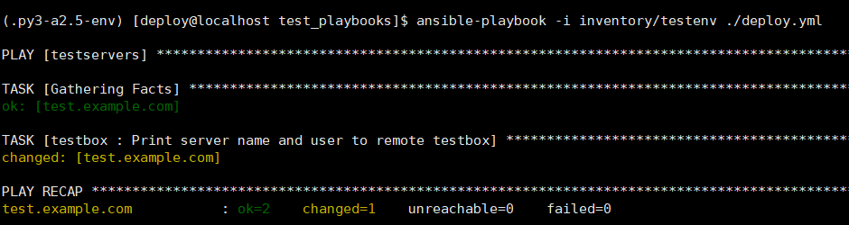
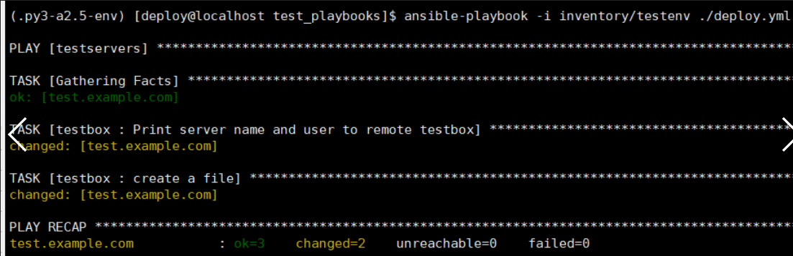
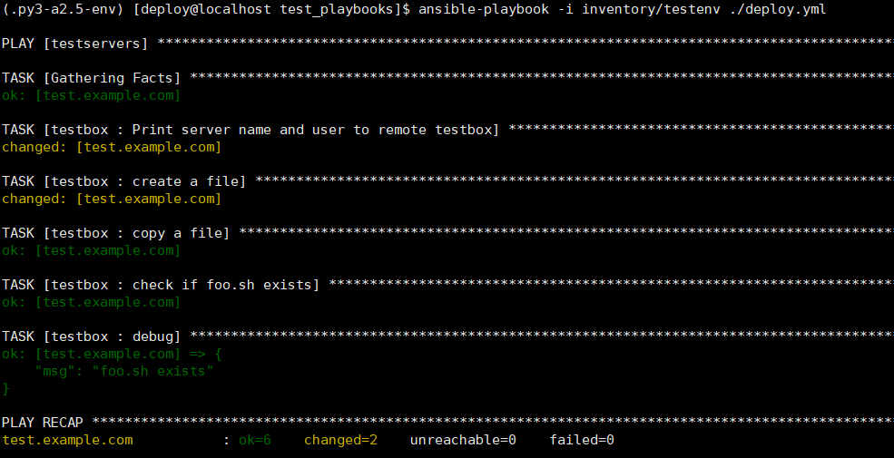
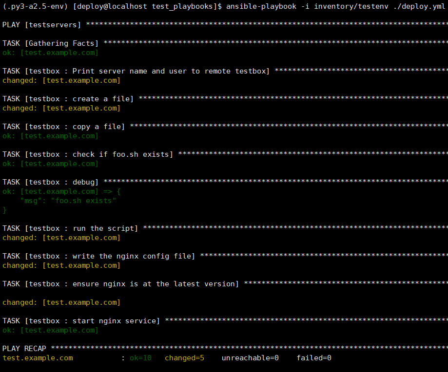
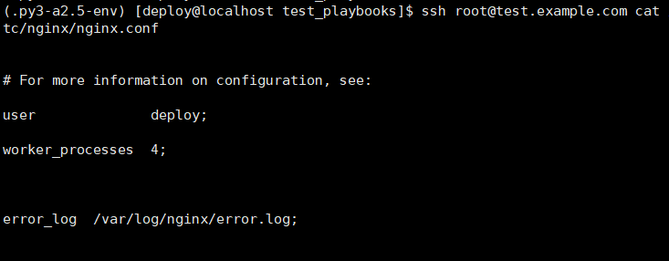

## 安装（通过git获取来安装）

官方安装教程https://docs.ansible.com/ansible/latest/installation_guide/intro_installation.html#from-source

### 安装python36

yum install python36

【【【或者是

wget <http://www.python.org/ftp/python/3.6.5/Python-3.6.5.tar.xz>

tar -xf Python-3.6.5.tar.xz

cd Python-3.6.5

./configure --prefix=/usr/local --with-ensurepip=install --enable-shared LDFLAGS="-Wl,-rpath /usr/local/lib"

make && make altinstall

~]# which pip3.6

  /usr/local/bin/pip3.6

~]# ln -s /usr/local/bin/pip3.6 /usr/local/bin/pip】】】

### 安装git并获取源码git文件

yum install git nss curl -y

安装虚拟环境和切换到deploy用户

pip3 install virtualenv -i <https://pypi.tuna.tsinghua.edu.cn/simple>

修改pip源为国内源

创建目录

mkdir ~/.pip

复制如下命令生成配置文件

cat << EOF >~/.pip/pip.conf

[global]

index-url = <https://mirrors.aliyun.com/pypi/simple>

EOF

 

 添加deploy用户

useradd deploy

su - deploy

 

(

~]# which python3

/usr/bin/python3

下面根据which python3查看到的更改

)

 

virtualenv -p /usr/bin/python3 .py3-a2.5-env

在码云导入GitHub项目以达到加速下载效果

git clone <https://gitee.com/jaykieq/ansible.git>

source /home/deploy/.py3-a2.5-env/bin/activate

pip install paramiko PyYAML jinja2

安装加载ansible2.5稳定版

cd ansible/

git checkout stable-2.5

source  /home/deploy/.py3-a2.5-env/ansible/hacking/env-setup -q或者是source  /home/deploy/.py3-a2.5-env/ansible/hacking/env-setup -q

（验证ansible --version為2.5）

 

 

到上面为止，ansible安装加载完成，以后要加载ansible就执行如下两个命令

source /home/deploy/.py3-a2.5-env/bin/activate

source  /home/deploy/ansible/hacking/env-setup -q

 

## 实例一

任务：打印服务器名和用户名输出到文件【【echo 'Curently {{ user }} is logining {{ server_name }}' > {{ output }}】】

mkdir test_playbooks && cd test_playbooks && mkdir inventory roles

 

生成环境配置文件

cat << EOF >inventory/testenv

[testservers]

test.example.com

 

[testservers:vars]

server_name=test.example.com

user=root

output=/root/test.txt

EOF

 

创建任务文件夹

mkdir -p roles/testbox/tasks

创建任务

```shell
cat << EOF > roles/testbox/tasks/main.yml

- name: Print server name and user to remote testbox

  shell: "echo 'Curently {{ user }} is logining {{ server_name }}' > {{ output }}"

EOF
```

 

创建部署文件

```shell
cat << EOF > deploy.yml

- hosts: "testservers"

  gather_facts: true

  remote_user: root

  roles:

    - testbox

EOF
```

 

查看目录结构

su root

（yum install tree -y

]# tree .

.

├── deploy.yml

├── inventory

│   └── testenv

└── roles

​    └── testbox

​        └── tasks

​            └── main.yml

）

 

这里的ip改成你要测试的ip

cat << EOF > /etc/hosts

192.168.227.138 test.example.com

EOF

 

 

创建密钥认证

exit退出root权限

ssh-keygen -t rsa（一路回车即可）

ssh-copy-id -i /home/deploy/.ssh/id_rsa.pub root@test.example.com

（输入yes回车，输入root密码）

（测试ssh 'root@test.example.com'  测试可以进去就exit退出到deploy账户）

在test_playbooks目录下执行

ansible-playbook -i inventory/testenv ./deploy.yml



changed=1 表示有变动的task个数为1

 unreachable=0 表没有到达不了的主机   

failed=0  表语法结构没有错

 

验证任务是否成功

ssh root@test.example.com

ls ~

~]# cat test.txt

Curently root is logining test.example.com

说明任务执行成功

 

以上为执行任务

## 实例二

任务：安装nginx

使用playbooks的file模块

目标机器执行命令

useradd foo

useradd deploy

[root@test ~]# mkdir /etc/nginx

[root@test ~]# rpm -Uvh <http://nginx.org/packages/centos/7/noarch/RPMS/nginx-release-centos-7-0.el7.ngx.noarch.rpm>

 

su deploy

cd /home/deploy/.py3-a2.5-env/ansible/test_playbooks/

```
cat << EOF > roles/testbox/tasks/main.yml

- name: Print server name and user to remote testbox

  shell: "echo 'Curently {{ user }} is logining {{ server_name }}' > {{ output }}"

- name: create a file

  file: 'path=/root/foo.txt state=touch mode=0755 owner=foo group=foo'
EOF
```

在test_playbooks目录下执行

ansible-playbook -i inventory/testenv ./deploy.yml

 

此时在对应服务器的/root/foo.txt,权限为0755，owner=foo group=foo

 

使用playbooks的copy模块

mkdir roles/testbox/files


cat << EOF > roles/testbox/files/foo.sh

echo "test"

EOF

```shell


cat << EOF > roles/testbox/tasks/main.yml

- name: Print server name and user to remote testbox

  shell: "echo 'Curently {{ user }} is logining {{ server_name }}' > {{ output }}"

- name: create a file

  file: 'path=/root/foo.txt state=touch mode=0755 owner=foo group=foo'

- name: copy a file

  copy: 'remote_src=no src=roles/testbox/files/foo.sh dest=/root/foo.sh mode=0644 force=yes'
EOF
```

在test_playbooks目录下执行

ansible-playbook -i inventory/testenv ./deploy.yml

 

使用Stat模块和Debug模块

```
cat << EOF > roles/testbox/tasks/main.yml

- name: Print server name and user to remote testbox

  shell: "echo 'Curentry {{ user }} is logining {{ server_name }}' > {{ output }}"

- name: create a file

  file: 'path=/root/foo.txt state=touch mode=0755 owner=foo group=foo'

- name: copy a file

  copy: 'remote_src=no src=roles/testbox/files/foo.sh dest=/root/foo.sh mode=0644 force=yes'

- name: check if foo.sh exists

  stat: 'path=/root/foo.sh'

  register: script_stat

- debug: msg="foo.sh exists"

  when: script_stat.stat.exists

EOF
```

在test_playbooks目录下执行

ansible-playbook -i inventory/testenv ./deploy.yml

显示信息




任务：指定机器上通过模板自定义配置文件安装nginx（指定机器上有foo用户且存在/etc/nginx目录）

添加参数

```shell
cat << EOF > inventory/testenv

[testservers]

test.example.com

 

[testservers:vars]

server_name=test.example.com

user=root

output=/root/test.txt

port=80

user=deploy

worker_processes=4

max_open_file=65505

root=/wwww
EOF


```

 创建目录

mkdir roles/testbox/templates


```shell
cat << EOF > roles/testbox/templates/nginx.conf.j2


# For more information on configuration, see: 

user              {{ user }};  

worker_processes  {{ worker_processes }};  

  

error_log  /var/log/nginx/error.log;  

  

pid        /var/run/nginx.pid;  

  

events {  

    worker_connections  {{ max_open_file }};  

}  

  

  

http {  

    include       /etc/nginx/mime.types;  

    default_type  application/octet-stream;  

  

    log_format  main  '$remote_addr - $remote_user [$time_local] "$request" '  

                      '$status $body_bytes_sent "$http_referer" '  

                      '"$http_user_agent" "$http_x_forwarded_for"';

  

    access_log  /var/log/nginx/access.log  main;  

  

    sendfile        on;  

    #tcp_nopush     on;  

  

    #keepalive_timeout  0;  

    keepalive_timeout  65;  

  

    #gzip  on;  

      

    # Load config files from the /etc/nginx/conf.d directory  

    # The default server is in conf.d/default.conf  

    #include /etc/nginx/conf.d/*.conf;  

    server {  

        listen       {{ port }} default_server;  

        server_name  {{ server_name }};  

  

        #charset koi8-r;  

  

        #access_log  logs/host.access.log  main;  

  

        location / {  

            root   {{ root }};  

            index  index.html index.htm;  

        }  

  

        error_page  404              /404.html;  

        location = /404.html {  

            root   /usr/share/nginx/html;  

        }  

  

        # redirect server error pages to the static page /50x.html  

        #  

        error_page   500 502 503 504  /50x.html;  

        location = /50x.html {  

            root   /usr/share/nginx/html;  

        }  

  

    }  

  

}
EOF
```


 

```shell
cat << EOF > roles/testbox/tasks/main.yml

- name: Print server name and user to remote testbox

  shell: "echo 'Curentry {{ user }} is logining {{ server_name }}' > {{ output }}"

- name: create a file

  file: 'path=/root/foo.txt state=touch mode=0755 owner=foo group=foo'

- name: copy a file

  copy: 'remote_src=no src=roles/testbox/files/foo.sh dest=/root/foo.sh mode=0644 force=yes'

- name: check if foo.sh exists

  stat: 'path=/root/foo.sh'

  register: script_stat

- debug: msg="foo.sh exists"

  when: script_stat.stat.exists

- name: run the script

  command: "sh /root/foo.sh"

- name: write the nginx config file

  template: src=roles/testbox/templates/nginx.conf.j2 dest=/etc/nginx/nginx.conf

- name: ensure nginx is at the latest version

  yum: pkg=nginx state=latest

- name: start nginx service

  service: name=nginx state=started
EOF
```


 

 ansible-playbook -i inventory/testenv ./deploy.yml




查看是否成功

ssh root@test.example.com cat /etc/nginx/nginx.conf



ssh root@test.example.com ps -ef | grep nginx

